<!-- .slide: data-auto-animate -->
# Persistent $\pi_1$
## & Lower-central-series barcodes

#### Gonzalo Ortega Carpintero
`gonzalo.ortega-carpintero@city.ac.uk`

    
<canvas id="torusCanvas" width="400" height="300" style="width: 500px; height: 400px;"></canvas>
    
<canvas id="sphereCanvas" width="400" height="300" style="width: 500px; height: 400px;"></canvas>

  
A joint work with Ximena Fernández at

  

*YTM 2026 - Monday, 29th June*

Notes:
- 

---

<!-- .slide: data-auto-animate -->
### The limitations of $H_*$

  <figure>
    
    <figcaption data-id="t1">$T = S_1 \times S_1$</figcaption>
  </figure>
  <figure>
    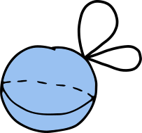
    <figcaption data-id="s1">$X = S^2 \vee S^1 \vee S^1$</figcaption>
  </figure>

All computations will be made with coefficients in a field $ \mathbb K $.

---

<!-- .slide: data-auto-animate -->
### The limitations of $H_*$

  <figure>
    
    <figcaption data-id="t1">$T = S_1 \times S_1$</figcaption>
  </figure>
  <figure>
    
    <figcaption data-id="s1">$X = S^2 \vee S^1 \vee S^1$</figcaption>
  </figure>

$$H_0(T) = \mathbb K = H_0(X)$$

 $$H_1(T) = \mathbb K \oplus \mathbb K = H_1(X)$$
$$H_2(T) = \mathbb K = H_2(X)$$
$$H_n(T) = 0 = H_n(X), $$
$$ \ n \geq 3 $$

---

<!-- .slide: data-auto-animate -->
### The limitations of $H_*$

  <figure>
    
    <figcaption data-id="t1">$T = S_1 \times S_1$</figcaption>
  </figure>
  <figure>
    
    <figcaption data-id="s1">$X = S^2 \vee S^1 \vee S^1$</figcaption>
  </figure>

 $$ H_1(T) = \mathbb K \oplus \mathbb K = H_1(X) $$

 $$ \pi_1(T) = \mathbb Z \oplus \mathbb Z \neq \mathbb Z * \mathbb Z = \pi_1(X)$$

---

<!-- .slide: data-auto-animate -->
### The limitations of persistent $H_*$

  $\mathcal T$: 
  <figure>
    
    <figcaption data-id="x1">$T_1$</figcaption>
  </figure>
  $\rightarrow$
  <figure>
    
    <figcaption data-id="x2">$T_2$</figcaption>
  </figure>
  $\rightarrow$
  <figure>
    
    <figcaption data-id="x3">$T_3$</figcaption>
  </figure>

  $\mathcal X$: 
  <figure>
    
    <figcaption data-id="y1">$X_1$</figcaption>
  </figure>
  $\rightarrow$
  <figure>
    
    <figcaption data-id="y2">$X_2$</figcaption>
  </figure>
  $\rightarrow$
  <figure>
    
    <figcaption data-id="y3">$X_3$</figcaption>
  </figure>

---

<!-- .slide: data-auto-animate -->
### The limitations of persistent $H_*$

  

    

      $\mathcal T$: 
      
      $\rightarrow$
      
      $\rightarrow$
      
    

    

      $$
      \begin{array}{ccccc}
      T_1 & \xrightarrow{} & T_2 & \xrightarrow{} & T_3\\
      \downarrow & & \downarrow &  & \downarrow \\
      H_1(T_1) & \xrightarrow{} & H_1(T_2) & \xrightarrow{} & H_1(T_3)\\
      \end{array}
      $$
    

  

  

    

      $\mathcal X$: 
      
      $\rightarrow$
      
      $\rightarrow$
      
    

    

      $$
      \begin{array}{ccccc}
      X_1 & \xrightarrow{} & X_2 & \xrightarrow{} & X_3\\
      \downarrow & & \downarrow &  & \downarrow \\
      H_1(X_1) & \xrightarrow{} & H_1(X_2) & \xrightarrow{} & H_1(X_3)\\
      \end{array}
      $$
      

  

---

<!-- .slide: data-auto-animate -->
### The limitations of persistent $H_*$

  

    

      $\mathcal T$: 
      
      $\rightarrow$
      
      $\rightarrow$
      
    

    

      $$
      \begin{array}{ccccc}
      T_1 & \xrightarrow{} & T_2 & \xrightarrow{} & T_3\\
      \downarrow \scriptsize{H_1} & & \downarrow \scriptsize{H_1} &  & \downarrow \scriptsize{H_1} \\
      \mathbb Z & \xrightarrow{} & \mathbb Z \oplus \mathbb Z & \xrightarrow{} & \mathbb Z \oplus \mathbb Z\\
      \end{array}
      $$
    

  

  

    

      $\mathcal X$: 
      
      $\rightarrow$
      
      $\rightarrow$
      
    

    

      $$
      \begin{array}{ccccc}
      X_1 & \xrightarrow{} & X_2 & \xrightarrow{} & X_3\\
      \downarrow \scriptsize{H_1} & & \downarrow \scriptsize{H_1} &  & \downarrow \scriptsize{H_1} \\
      \mathbb Z & \xrightarrow{} & \mathbb Z \oplus \mathbb Z & \xrightarrow{} & \mathbb Z \oplus \mathbb Z\\
      \end{array}
      $$
    

  

---
<!-- .slide: data-auto-animate -->
### The limitations of persistent $H_*$

  

    

      $\mathcal T$: 
      
      $\rightarrow$
      
      $\rightarrow$
      
    

    

      $$
      \begin{array}{ccccc}
      T_1 & \xrightarrow{} & T_2 & \xrightarrow{} & T_3\\
      \downarrow \scriptsize{H_1} & & \downarrow \scriptsize{H_1} &  & \downarrow \scriptsize{H_1} \\
      \mathbb Z & \xrightarrow{} & \mathbb Z \oplus \mathbb Z& \xrightarrow{} & \mathbb Z \oplus \mathbb Z\\
      \end{array}
      $$
      

    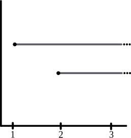
  

  

    

      $\mathcal X$: 
      
      $\rightarrow$
      
      $\rightarrow$
      
    

    

      $$
      \begin{array}{ccccc}
      X_1 & \xrightarrow{} & X_2 & \xrightarrow{} & X_3\\
      \downarrow \scriptsize{H_1} & & \downarrow \scriptsize{H_1} &  & \downarrow \scriptsize{H_1} \\
      \mathbb Z & \xrightarrow{} & \mathbb Z \oplus \mathbb Z & \xrightarrow{} & \mathbb Z \oplus \mathbb Z\\
      \end{array}
      $$
    

    
  

$$ PH_1(\mathcal T) = PH_1(\mathcal X)$$

All barcodes coincide.

---

<!-- .slide: data-auto-animate -->
### The limitations of persistent $H_*$

  

    

      $\mathcal T$: 
      
      $\rightarrow$
      
      $\rightarrow$
      
    

    

      $$
      \begin{array}{ccccc}
      T_1 & \xrightarrow{} & T_2 & \xrightarrow{} & T_3\\
      \downarrow & & \downarrow &  & \downarrow \\
      H_1(T_1) & \xrightarrow{} & H_1(T_2) & \xrightarrow{} & H_1(T_3)\\
      \end{array}
      $$
      

  

  

    

      $\mathcal X$: 
      
      $\rightarrow$
      
      $\rightarrow$
      
    

    

      $$
      \begin{array}{ccccc}
      X_1 & \xrightarrow{} & X_2 & \xrightarrow{} & X_3\\
      \downarrow & & \downarrow &  & \downarrow \\
      H_1(X_1) & \xrightarrow{} & H_1(X_2) & \xrightarrow{} & H_1(X_3)\\
      \end{array}
      $$
      

  

### What would we like to do?

---

<!-- .slide: data-auto-animate -->
### The limitations of persistent $H_*$

  

    

      $\mathcal T$: 
      
      $\rightarrow$
      
      $\rightarrow$
      
    

    

      $$
      \begin{array}{ccccc}
      T_1 & \xrightarrow{} & T_2 & \xrightarrow{} & T_3\\
      \downarrow & & \downarrow &  & \downarrow \\
      H_1(T_1) & \xrightarrow{} & H_1(T_2) & \xrightarrow{} & H_1(T_3)\\
      \end{array}
      $$
    

  

  

    

      $\mathcal X$: 
      
      $\rightarrow$
      
      $\rightarrow$
      
    

    

      $$
      \begin{array}{ccccc}
      X_1 & \xrightarrow{} & X_2 & \xrightarrow{} & X_3\\
      \downarrow & & \downarrow &  & \downarrow \\
      H_1(X_1) & \xrightarrow{} & H_1(X_2) & \xrightarrow{} & H_1(X_3)\\
      \end{array}
      $$
      

  

### Persistent $\pi_1$

  

    $$
    \begin{array}{ccccc}
    T_1 & \xrightarrow{} & T_2 & \xrightarrow{} & T_3\\
    \downarrow & & \downarrow &  & \downarrow \\
    \pi_1(T_1) & \xrightarrow{} & \pi_1(T_2) & \xrightarrow{} & \pi_1(T_3)\\
    \end{array}
    $$
  

  

    $$
    \begin{array}{ccccc}
    X_1 & \xrightarrow{} & X_2 & \xrightarrow{} & X_3\\
    \downarrow & & \downarrow &  & \downarrow \\
    \pi_1(X_1) & \xrightarrow{} & \pi_1(X_2) & \xrightarrow{} & \pi_1(X_3)\\
    \end{array}
    $$
  

**Convention**: All spaces are path-conected and contain a common base point.

---

<!-- .slide: data-auto-animate -->

  <h3> Can $\pi_1$ be algorithmically computed? </h3>

---

<!-- .slide: data-auto-animate -->

  <h3> Can $\pi_1$ be algorithmically computed? </h3>
  <h3>YES*</h3>

---

<!-- .slide: data-auto-animate -->

  <h3> Can $\pi_1$ be algorithmically computed? </h3>
  <h3>YES*</h3>

*We can compute a <b>presentation</b> of $\pi_1$ of a CW complex.

*(All CW complexes will be **finite** and **path-connected** in this presentation.)*

---

<!-- .slide: data-auto-animate -->

  <h3> Can $\pi_1$ be algorithmically computed? </h3>
  <h3>YES*</h3>

*We can compute a <b>presentation</b> of $\pi_1$ of a CW complex.

***Naive computation***: Using the <b>spanning tree</b> algorithm.

---

<!-- .slide: data-auto-animate -->

  <h3> Can $\pi_1$ be algorithmically computed? </h3>
  <h3>YES*</h3>

*We can compute a <b>presentation</b> of $\pi_1$ of a CW complex.

***Naive computation***: Using the <b>spanning tree</b> algorithm.

$$ T $$

---

<!-- .slide: data-auto-animate -->

  <h3> Can $\pi_1$ be algorithmically computed? </h3>
  <h3>YES*</h3>

*We can compute a <b>presentation</b> of $\pi_1$ of a CW complex.

***Naive computation***: Using the <b>spanning tree</b> algorithm.

$$ T $$

---

<!-- .slide: data-auto-animate -->

  <h3> Can $\pi_1$ be algorithmically computed? </h3>
  <h3>YES*</h3>

*We can compute a <b>presentation</b> of $\pi_1$ of a CW complex.

***Naive computation***: Using the <b>spanning tree</b> algorithm.

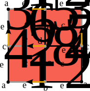

$$ T $$

---

<!-- .slide: data-auto-animate -->

  <h3> Can $\pi_1$ be algorithmically computed? </h3>
  <h3>YES*</h3>

*We can compute a <b>presentation</b> of $\pi_1$ of a CW complex.

***Naive computation***: Using the <b>spanning tree</b> algorithm.

$$ T \cong \langle e_2, e_4, e_5, e_7, e_8 \mid e_5, \ e_2^{-1} e_7, e_5^{-1}, \ e_7^{-1} e_4^{-1} e_2 e_8, \ e_8^{-1} e_4 \rangle$$

---

<!-- .slide: data-auto-animate -->

  <h3> Can $\pi_1$ be algorithmically computed? </h3>
  <h3>YES*</h3>

*We can compute a <b>presentation</b> of $\pi_1$ of a CW complex.

***Naive computation***: Using the <b>spanning tree</b> algorithm.

***Efficient computation***: Using <b>discrete Morse theory</b> to obtain a reduced presentation.

---

<!-- .slide: data-auto-animate -->

  <h3> Can $\pi_1$ be algorithmically computed? </h3>
  <h3>YES*</h3>

*We can compute a <b>presentation</b> of $\pi_1$ of a CW complex.

***Efficient computation***: Using <b>discrete Morse theory</b> to obtain a reduced presentation.

Let $ K $ be a regular CW complex and let $ M $ be an acyclic matching on the cells of K.

>**Theorem (Forman, 1995; Chari 2000)**: $ K $ is homotopy equivalent to a CW complex with exactly one cell of dimension $ p $ for each critical (ie., unmatched) cell of dimension $ p $.

---

<!-- .slide: data-auto-animate -->

  <h3> Can $\pi_1$ be algorithmically computed? </h3>
  <h3>YES*</h3>

*We can compute a <b>presentation</b> of $\pi_1$ of a CW complex.

***Efficient computation***: Using <b>discrete Morse theory</b> to obtain a reduced presentation.

Let $ K $ be a regular CW complex and let $ M $ be an acyclic matching on the cells of K \
with only one 0-dimensional critic cell.

>**Theorem (Fernández, 2024)**: A presentation $\mathcal P = \langle X \mid R \rangle $ of $ \pi_1(K) $ with
$$\\# X = \\# 1\text{-dim critical cells}$$
$$\\# R = \\# 2\text{-dim critical cells}$$
can be computed with complexity $ \mathcal O (N^2) $, where
$$N = \\# \text{cells in the 2-skeleton of } K.$$

---

<!-- .slide: data-auto-animate -->

  <h3> Can $\pi_1$ be algorithmically computed? </h3>
  <h3>YES*</h3>

*We can compute a <b>presentation</b> of $\pi_1$ of a CW complex.

***Efficient computation***: Using <b>discrete Morse theory</b> to obtain a reduced presentation.

$$ T $$

---

<!-- .slide: data-auto-animate -->

  <h3> Can $\pi_1$ be algorithmically computed? </h3>
  <h3>YES*</h3>

*We can compute a <b>presentation</b> of $\pi_1$ of a CW complex.

***Efficient computation***: Using <b>discrete Morse theory</b> to obtain a reduced presentation.

$$ T $$

---

<!-- .slide: data-auto-animate -->

  <h3> Can $\pi_1$ be algorithmically computed? </h3>
  <h3>YES*</h3>

*We can compute a <b>presentation</b> of $\pi_1$ of a CW complex.

***Efficient computation***: Using <b>discrete Morse theory</b> to obtain a reduced presentation.

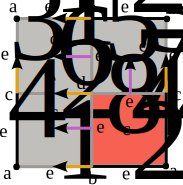

$$ T $$

---

<!-- .slide: data-auto-animate -->

  <h3> Can $\pi_1$ be algorithmically computed? </h3>
  <h3>YES*</h3>

*We can compute a <b>presentation</b> of $\pi_1$ of a CW complex.

***Efficient computation***: Using <b>discrete Morse theory</b> to obtain a reduced presentation.

$$ T \cong \langle e_2, e_4 \mid e_2^{-1} e_4^{-1} e_2 e_4 \rangle$$

---

<!-- .slide: data-auto-animate -->

  <h3> Can $\pi_1$ be algorithmically computed? </h3>
  <h3>YES*</h3>

  <h3> Can $\pi_1$ be computed <u>over a filtration</u>? </h3>

---

<!-- .slide: data-auto-animate -->

  <h3> Can $\pi_1$ be algorithmically computed? </h3>
  <h3>YES*</h3>

  <h3> Can <u>persistent</u> $\pi_1$ be computed? </h3>

---

<!-- .slide: data-auto-animate -->

  <h3> Can $\pi_1$ be algorithmically computed? </h3>
  <h3>YES*</h3>

  <h3> Can <u>persistent</u> $\pi_1$ be computed? </h3>
  <h3>YES*</h3>

---

<!-- .slide: data-auto-animate -->

  <h3> Can $\pi_1$ be algorithmically computed? </h3>
  <h3>YES*</h3>

  <h3> Can <u>persistent</u> $\pi_1$ be computed? </h3>
  <h3>YES*</h3>

Let $ K_\bullet $ be a path-connected based filtration of finite CW-complexes.

$$
\begin{array}{ccccccc}
K_1 & \xrightarrow{} & K_2 & \xrightarrow{} & \dots \xrightarrow{} & K_n\\
\downarrow & & \downarrow &  &   & \downarrow\\
\pi_1(K_1) & \xrightarrow{} & \pi_1(K_2) & \xrightarrow{} & \dots \xrightarrow{} & \pi_1(K_n)\\
\end{array}
$$

***Naive computation***: Compute $ \pi_1 $ presentations <b>independently</b> over every element in the filtration.

---

<!-- .slide: data-auto-animate -->

  <h3> Can $\pi_1$ be algorithmically computed? </h3>
  <h3>YES*</h3>

  <h3> Can <u>persistent</u> $\pi_1$ be computed? </h3>
  <h3>YES*</h3>

Let $ K_\bullet $ be a path-connected based filtration of finite CW-complexes.

$$
\begin{array}{ccccccc}
K_1 & \xrightarrow{} & K_2 & \xrightarrow{} & \dots \xrightarrow{} & K_n\\
\downarrow & & \downarrow &  &   & \downarrow\\
\pi_1(K_1) & \xrightarrow{} & \pi_1(K_2) & \xrightarrow{} & \dots \xrightarrow{} & \pi_1(K_n)\\
\end{array}
$$

***Naive computation***: Compute $ \pi_1 $ presentations <b>independently</b> over every element in the filtration.

***Efficient computation***: Perform a <b>single computation</b>  over the whole filtration.

---

<!-- .slide: data-auto-animate -->

  <h3> Can $\pi_1$ be algorithmically computed? </h3>
  <h3>YES*</h3>

  <h3> Can <u>persistent</u> $\pi_1$ be computed? </h3>
  <h3>YES*</h3>

***Efficient computation***: Perform a <b>single computation</b>  over the whole filtration.

<blockquote>
<b>Theorem (Fernández, O., 2026)</b>: Let $ M_\bullet $ be an acyclic matching with only one 0-dim critical cell over $K_\bullet$. Presentations $ \mathcal P_i = \langle X_i \mid R_i \rangle $ of $ \pi_1(K_i) $ with

$$
\begin{array}{c}
\# X_i = \# 1\text{-dim critical cells of } K_i, \\
\#R_i = \# 2\text{-dim critical cells of } K_i \\
\end{array}
$$

and morphisms $ \psi_{i\to j}: \mathcal P_i \to \mathcal P_j $ such that the following commutes 

$$
\begin{array}{ccc}
K_i & \hookrightarrow{} & K_j \\
\downarrow & & \downarrow \\
\mathcal P_i & \xrightarrow{\psi_{i\to j}} & \mathcal P_j\\
\end{array}
$$

can be computed in $ \mathcal O(N^2) $, $ N = \#$ cells in the 2-skeleton of $K$.
</blockquote>

---

<!-- .slide: data-auto-animate -->

  <h3> Can $\pi_1$ be algorithmically computed? </h3>
  <h3>YES*</h3>

  <h3> Can <u>persistent</u> $\pi_1$ be computed? </h3>
  <h3>YES*</h3>

***Efficient computation***: Perform a <b>single computation</b>  over the whole filtration.

**SAGE Math implementation**

<pre><code>
    def filtrated_fundamental_group(self, fil, verbose = True):
        S = set()
        R = []
        filtrated_fundamental_group = []
        maps = [[None] * (fil+1) for _ in range(len(self.cells_lists[1]))]

        for f in range(0, fil+1):
            
            for cell in self.filtration_unmatched_2_cells[f]:
                R.append(cell.boundary_cells)

            for cell in self.filtration_matched_1_cells_with_0_cells[f]:
                cell.equivalence = '1'
                maps[cell.count][f] = 1

            for cell in self.filtration_matched_1_cells_with_2_cells[f]:
                gens = cell.matched.boundary_cells[:]
                idx = next((i for i, gen in enumerate(gens) if gen[0].name == cell.name), None)
                if idx is not None:
                    w1 = gens[:idx]
                    w2 = gens[idx+1:]
                    (_, sign) = gens[idx]
                    x = self._invert_word(w1) + self._invert_word(w2)
                    if sign == 1:
                        cell.equivalence = x
                    else: 
                        cell.equivalence = self._invert_word(x)

                maps[cell.count][f] = list(self._iter_flatten(cell.equivalence))

            for cell in set(self.filtration_unmatched_1_cells[f]):
                S.add(cell)
                maps[cell.count][f] = cell.name
                
            S = set([x for x in S if not isinstance(x.equivalence, list)])
            R = [list(self._iter_flatten(item)) for item in R]

            F = FreeGroup(names=S)
            gens = dict(zip([str(s) for s in S], F.gens()))
            relations = [
                prod(gens[str(e)]**Integer(sign) for e, sign in rel)
                for rel in R
            ]
            G = F / relations
            filtrated_fundamental_group.append(G)

            if verbose:
                print(str(f) + ': ' + str(G))
</code></pre>

---

<!-- .slide: data-auto-animate -->

  <h3> Can $\pi_1$ be algorithmically computed? </h3>
  <h3>YES*</h3>

  <h3> Can <u>persistent</u> $\pi_1$ be computed? </h3>
  <h3>YES*</h3>

  $\mathcal T:$ 
  
  $\rightarrow$
  
  $\rightarrow$
  

---

<!-- .slide: data-auto-animate -->

  <h3> Can $\pi_1$ be algorithmically computed? </h3>
  <h3>YES*</h3>

  <h3> Can <u>persistent</u> $\pi_1$ be computed? </h3>
  <h3>YES*</h3>

  
  $\rightarrow$
  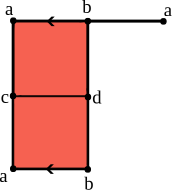
  $\rightarrow$
  

---

<!-- .slide: data-auto-animate -->

  <h3> Can $\pi_1$ be algorithmically computed? </h3>
  <h3>YES*</h3>

  <h3> Can <u>persistent</u> $\pi_1$ be computed? </h3>
  <h3>YES*</h3>

  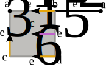
  $\rightarrow$
  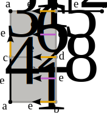
  $\rightarrow$
  

  <!-- second row -->
  
$$ \langle e_2 \mid - \rangle $$

  

  
$$ \langle e_2, e_4 \mid - \rangle $$

  

  

    $$ \langle e_2, e_4 \mid e_2^{-1} e_4^{-1} e_2 e_4\rangle $$
  

---

<!-- .slide: data-auto-animate -->

  <h3> Can $\pi_1$ be algorithmically computed? </h3>
  <h3>YES*</h3>

  <h3> Can <u>persistent</u> $\pi_1$ be computed? </h3>
  <h3>YES*</h3>

  $\mathcal X:$ 
  
  $\rightarrow$
  
  $\rightarrow$
  

---

<!-- .slide: data-auto-animate -->

  <h3> Can $\pi_1$ be algorithmically computed? </h3>
  <h3>YES*</h3>

  <h3> Can <u>persistent</u> $\pi_1$ be computed? </h3>
  <h3>YES*</h3>

  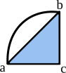
  $\rightarrow$
  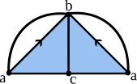
  $\rightarrow$
  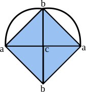

---

<!-- .slide: data-auto-animate -->

  <h3> Can $\pi_1$ be algorithmically computed? </h3>
  <h3>YES*</h3>

  <h3> Can <u>persistent</u> $\pi_1$ be computed? </h3>
  <h3>YES*</h3>

  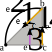
  $\rightarrow$
  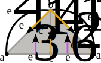
  $\rightarrow$
  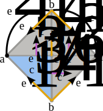

  <!-- second row -->
  
$$ \langle e_2 \mid - \rangle $$

  

  
$$ \langle e_2, e_5 \mid - \rangle $$

  

  

    $$ \langle e_2, e_5 \mid - \rangle $$
  

---

<!-- .slide: data-auto-animate -->

  <h3> Can $\pi_1$ be algorithmically computed? </h3>
  <h3>YES*</h3>

  <h3> Can <u>persistent</u> $\pi_1$ be computed? </h3>
  <h3>YES*</h3>

$$ \begin{align*}
  P\pi_1(\mathcal T) &= \langle t_1 \mid - \rangle \rightarrow \langle t_1, t_2 \mid - \rangle \rightarrow \langle t_1, t_2 \mid t_1^{-1} t_2^{-1} t_1 t_2\rangle, \\
  P\pi_1(\mathcal X) &= \langle x_1 \mid - \rangle \rightarrow \langle x_1, x_2 \mid - \rangle \rightarrow \langle x_1, x_2 \mid - \rangle.
\end{align*} $$

---

<!-- .slide: data-auto-animate -->

  <h3> Can $\pi_1$ be algorithmically computed? </h3>
  <h3>YES*</h3>

  <h3> Can <u>persistent</u> $\pi_1$ be computed? </h3>
  <h3>YES*</h3>

$$ \begin{align*}
  P\pi_1(\mathcal T) &= \langle t_1 \mid - \rangle \rightarrow \langle t_1, t_2 \mid - \rangle \rightarrow \langle t_1, t_2 \mid t_1^{-1} t_2^{-1} t_1 t_2\rangle, \\
  P\pi_1(\mathcal X) &= \langle x_1 \mid - \rangle \rightarrow \langle x_1, x_2 \mid - \rangle \rightarrow \langle x_1, x_2 \mid - \rangle.
\end{align*} $$

  <h3> Can we make $\pi_1$ barcodes as in $H_*$? </h3>

---

<!-- .slide: data-auto-animate -->

  <h3> Can $\pi_1$ be algorithmically computed? </h3>
  <h3>YES*</h3>

  <h3> Can <u>persistent</u> $\pi_1$ be computed? </h3>
  <h3>YES*</h3>

$$ \begin{align*}
  P\pi_1(\mathcal T) &= \langle t_1 \mid - \rangle \rightarrow \langle t_1, t_2 \mid - \rangle \rightarrow \langle t_1, t_2 \mid t_1^{-1} t_2^{-1} t_1 t_2\rangle, \\
  P\pi_1(\mathcal X) &= \langle x_1 \mid - \rangle \rightarrow \langle x_1, x_2 \mid - \rangle \rightarrow \langle x_1, x_2 \mid - \rangle.
\end{align*} $$

  <h3> Can we make $\pi_1$ barcodes as in $H_*$? </h3>
  <h3>NO*</h3>

---

<!-- .slide: data-auto-animate -->

  <h3> Can $\pi_1$ be algorithmically computed? </h3>
  <h3>YES*</h3>

  <h3> Can <u>persistent</u> $\pi_1$ be computed? </h3>
  <h3>YES*</h3>

$$ \begin{align*}
  P\pi_1(\mathcal T) &= \langle t_1 \mid - \rangle \rightarrow \langle t_1, t_2 \mid - \rangle \rightarrow \langle t_1, t_2 \mid t_1^{-1} t_2^{-1} t_1 t_2\rangle, \\
  P\pi_1(\mathcal X) &= \langle x_1 \mid - \rangle \rightarrow \langle x_1, x_2 \mid - \rangle \rightarrow \langle x_1, x_2 \mid - \rangle.
\end{align*} $$

  <h3> Can we make $\pi_1$ barcodes as in $H_*$? </h3>
  <h3>NO*</h3>

- The groups $ \pi_1(K_\alpha) $ in $ K_\bullet \to P \pi_1(K)_\bullet$
$$
\begin{array}{ccccccc}
\pi_1(K_1) & \xrightarrow{} & \pi_1(K_2) & \xrightarrow{} & \dots \xrightarrow{} & \pi_1(K_n)\\
\end{array}
$$
are generally non-abelian.

---

<!-- .slide: data-auto-animate -->

  <h3> Can $\pi_1$ be algorithmically computed? </h3>
  <h3>YES*</h3>

  <h3> Can <u>persistent</u> $\pi_1$ be computed? </h3>
  <h3>YES*</h3>

$$ \begin{align*}
  P\pi_1(\mathcal T) &= \langle t_1 \mid - \rangle \rightarrow \langle t_1, t_2 \mid - \rangle \rightarrow \langle t_1, t_2 \mid t_1^{-1} t_2^{-1} t_1 t_2\rangle, \\
  P\pi_1(\mathcal X) &= \langle x_1 \mid - \rangle \rightarrow \langle x_1, x_2 \mid - \rangle \rightarrow \langle x_1, x_2 \mid - \rangle.
\end{align*} $$

  <h3> Can we make $\pi_1$ barcodes as in $H_*$? </h3>
  <h3>NO*</h3>

- The groups $ \pi_1(K_\alpha) $ in $ K_\bullet \to P \pi_1(K)_\bullet$
$$
\begin{array}{ccccccc}
\pi_1(K_1) & \xrightarrow{} & \pi_1(K_2) & \xrightarrow{} & \dots \xrightarrow{} & \pi_1(K_n)\\
\end{array}
$$
are generally non-abelian.

- Finite presentations are not group invariants in general.

- Ordinary barcode decompositions do not apply.

---
## IDEA:

### Look for an abelian invariant of $\pi_1$

---

<!-- .slide: data-auto-animate -->
### Lower central quotients

---

<!-- .slide: data-auto-animate -->
### Lower central quotients

>**Definition**: The **lower central series** of a group $ G $ is the descending series of normal subgroups
$$ G = \gamma_1(G) \trianglerighteq \gamma_2(G) \trianglerighteq \dots \trianglerighteq \gamma_n(G) \trianglerighteq \dots $$
where
$$ \gamma_{n+1}(G) = [\gamma_n(G), G] = \langle \{ [h, g] : h \in \gamma_n(G), \ g \in G \}\rangle. $$

---

<!-- .slide: data-auto-animate -->
### Lower central quotients

>**Definition**: The **lower central series** of a group $ G $ is the descending series of normal subgroups
$$ G = \gamma_1(G) \trianglerighteq \gamma_2(G) \trianglerighteq \dots \trianglerighteq \gamma_n(G) \trianglerighteq \dots $$
where
$$ \gamma_{n+1}(G) = [\gamma_n(G), G] = \langle \{ [h, g] : h \in \gamma_n(G), \ g \in G \}\rangle. $$

>**Definition**: We define the **$n^\text{th}$-lower central quotient** of $ G $ as
$$ lcq_n(G) := \frac{\gamma_n(G)}{\gamma_{n+1}(G)}. $$

---
<!-- .slide: data-auto-animate -->
### Lower central quotients

<b>Example</b>: Let $ G = \pi_1(K) $.

---

<!-- .slide: data-auto-animate -->
### Lower central quotients

<b>Example</b>: Let $ G = \pi_1(K) $.

$$
lcq_1(G) = \frac{G}{[G, G]} \cong H_1(K),
$$
$$
lcq_2(G) = \frac{[G, G]}{[[G, G], G]},
$$
$$
lcq_3(G) = \frac{[[G, G], G]}{[[[G, G], G], G]},
$$
$$
\dots
$$

---

<!-- .slide: data-auto-animate -->
### Lower central quotients

<b>Example (Wedge of circles)</b>: Let $ K = \bigvee_n S^1 $, $ G = \pi_1\left(K\right) = F_n $.

$$
  lcq_1 (F_n) \cong \mathbb Z^n,
$$
$$
  lcq_2 (F_n) \cong \mathbb Z^{\binom{n}{2}},
$$
$$
  lcq_2 (F_n) \cong \mathbb Z^{n\binom{n}{2} - \binom{n}{3}}.
$$

---

<!-- .slide: data-auto-animate -->
### Lower central quotients

<b>Example (Wedge of circles)</b>: Let $ K = \bigvee_n S^1 $, $ G = \pi_1\left(K\right) = F_n $.

$$
  lcq_1 (F_n) \cong \mathbb Z^n,
$$
$$
  lcq_2 (F_n) \cong \mathbb Z^{\binom{n}{2}},
$$
$$
  lcq_3 (F_n) \cong \mathbb Z^{n\binom{n}{2} - \binom{n}{3}}.
$$

>For every $ n $, $ lcq_n(G) $ is abelian.

---

<!-- .slide: data-auto-animate -->
### Lower central quotients

>For every $ n $, $ lcq_n(G) $ is abelian.

>For every $ n $, $ lcq_n(G) $ can be algoritmically computed from a presentation of $ G $.
**(Sims, 1994)**

---

<!-- .slide: data-auto-animate -->
### Lower central quotients

>For every $ n $, $ lcq_n(G) $ is abelian.

>For every $ n $, $ lcq_n(G) $ can be algoritmically computed from a presentation of $ G $.
**(Sims, 1994)**

>The complexity of the computation of $ lcq_n(G) $ depends on the number of generators and relations of the presentation of $ G $ we are using.

---
<!-- .slide: data-auto-animate -->
### Persistent Lower central quotients

---

<!-- .slide: data-auto-animate -->
### Persistent Lower central quotients

>**Definition**: Let $\mathbb K $ a fixed field. We define the <b> $\mathbb K $-tensored $n^\text{th}$-lower central quotient </b>  as
$$
  lcq_n^{\mathbb K} := lcq_n \otimes_{\mathbb Z} \mathbb K
$$

---

<!-- .slide: data-auto-animate -->
### Persistent lower central quotients

$$
\begin{array}{ccccccc}
K_1 & \xrightarrow{} & K_2 & \xrightarrow{} & \dots \xrightarrow{} & K_n\\
\downarrow & & \downarrow &  &   & \downarrow\\
\pi_1(K_1) & \xrightarrow{} & \pi_1(K_2) & \xrightarrow{} & \dots \xrightarrow{} & \pi_1(K_n)\\
\downarrow \scriptstyle{\xi_1} & & \downarrow \scriptstyle{\xi_2} &  &   & \downarrow \scriptstyle{\xi_n}\\
lcq_n^{\mathbb K}(\pi_1(K_1)) & \xrightarrow{} & lcq_n^{\mathbb K}(\pi_1(K_2)) & \xrightarrow{} & \dots \xrightarrow{} & lcq_n^{\mathbb K}(\pi_1(K_n))\\
\end{array}
$$

Here we obtain a functor

$$
  \begin{align*}
    \xi_\alpha : &\bold{Grp} \to \bold{Vect}_{\mathbb K} \\
    & G \mapsto \frac{\gamma_n(G)}{\gamma_{n+1}(G)} \otimes_{\mathbb Z} \mathbb K
  \end{align*}
$$

---

<!-- .slide: data-auto-animate -->
### Persistent lower central quotients

Every $ lcq_n(\pi_1(K_\alpha)) $ is abelian so
$$
\begin{array}{ccccccc}
lcq_n^{\mathbb K}(\pi_1(K_1)) & \xrightarrow{} & lcq_n^{\mathbb K}(\pi_1(K_2)) & \xrightarrow{} & \dots \xrightarrow{} & lcq_n^{\mathbb K}(\pi_1(K_n))\\
\end{array}
$$
is a <b>persistent module</b> over the field $ \mathbb K $ (ie. a graded $ \mathbb K [t] $-module).

---

<!-- .slide: data-auto-animate -->
### Persistent lower central quotients

Every $ lcq_n(\pi_1(K_\alpha)) $ is abelian so
$$
\begin{array}{ccccccc}
lcq_n^{\mathbb K}(\pi_1(K_1)) & \xrightarrow{} & lcq_n^{\mathbb K}(\pi_1(K_2)) & \xrightarrow{} & \dots \xrightarrow{} & lcq_n^{\mathbb K}(\pi_1(K_n))\\
\end{array}
$$
is a <b>persistent module</b> over the field $ \mathbb K $ (ie. a graded $ \mathbb K [t] $-module).

>We can compute <b>barcodes</b>.
**(Skraba & Vejdemo-Johansson, 2013)**

---

<!-- .slide: data-auto-animate -->
### Lower central quotients

  

    $\mathcal T$: 
    
    $\rightarrow$
    
    $\rightarrow$
    
  

  

  $$
  \begin{array}{ccccc}
  T_1 & \xrightarrow{} & T_2 & \xrightarrow{} & T_3\\
  \downarrow\scriptstyle{\pi_1} & & \downarrow\scriptstyle{\pi_1} &  & \downarrow\scriptstyle{\pi_1} \\
  \mathbb Z & \xrightarrow{} & \mathbb Z * \mathbb Z & \xrightarrow{} & \mathbb Z \oplus \mathbb Z\\
  \downarrow\scriptstyle{lcq_2^{\mathbb K}} & & \downarrow\scriptstyle{lcq_2^{\mathbb K}} & & \downarrow\scriptstyle{lcq_2^{\mathbb K}} \\
  0 & \xrightarrow{} & \mathbb K & \xrightarrow{} & 0\\
  \end{array}
  $$
  

  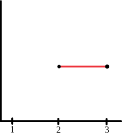

  

    $\mathcal X$: 
    
    $\rightarrow$
    
    $\rightarrow$
    
  

  

  $$
  \begin{array}{ccccc}
  X_1 & \xrightarrow{} & X_2 & \xrightarrow{} & X_3\\
  \downarrow\scriptstyle{\pi_1} & & \downarrow\scriptstyle{\pi_1} &  & \downarrow\scriptstyle{\pi_1} \\
  \mathbb Z & \xrightarrow{} & \mathbb Z * \mathbb Z & \xrightarrow{} & \mathbb Z * \mathbb Z\\
  \downarrow\scriptstyle{lcq_2^{\mathbb K}} & & \downarrow\scriptstyle{lcq_2^{\mathbb K}} &  & \downarrow\scriptstyle{lcq_2^{\mathbb K}} \\
  0 & \xrightarrow{} & \mathbb K  & \xrightarrow{} & \mathbb K\\
  \end{array}
  $$
  

  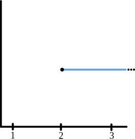

---

<!-- .slide: data-auto-animate -->
### Lower central quotients
**Example:** $lcq_n$ barcodes of links.

  Unlinked rings
  $\mathcal U$:
  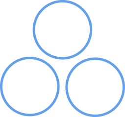
  $\rightarrow$
  
  $\rightarrow$
  

  Linked rings
  $\mathcal L$:
  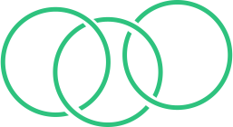
  $\rightarrow$
  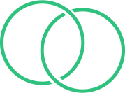
  $\rightarrow$
  

  Baromean rings
  $\mathcal R$:
  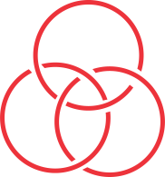
  $\rightarrow$
  
  $\rightarrow$
  

---

<!-- .slide: data-auto-animate -->

**Example:** $lcq_n$ barcodes of links. **($\pi_1$)**

  

  

    $\mathcal U$:
    
    $\rightarrow$
    
    $\rightarrow$
    
  

    $$
    \begin{align*}
      \pi_1(\mathbb R^3 \setminus U_1) &= \langle u_1, u_2, u_3 \mid - \rangle \\
      \pi_1(\mathbb R^3 \setminus U_2) &= \langle u_1, u_2 \mid - \rangle \\
      \pi_1(\mathbb R^3 \setminus U_3) &= \langle u_1 \mid - \rangle \\
    \end{align*}
    $$
  

  

  

    $\mathcal L$:
    
    $\rightarrow$
    
    $\rightarrow$
    
  

    $$
    \begin{align*}
      \pi_1(\mathbb R^3 \setminus L_1) &= \langle l_1, l_2, l_3 \mid [l_1, l_2], [l_1l_3, l_2] \rangle \\
      \pi_1(\mathbb R^3 \setminus L_2) &= \langle l_1, l_2 \mid [l_1, l_2] \rangle \\
      \pi_1(\mathbb R^3 \setminus L_3) &= \langle l_1 \mid - \rangle \\
    \end{align*}
    $$
  

  $\mathcal R$:
  
  $\rightarrow$
  
  $\rightarrow$
  

$$
\begin{align*}
    \pi_1(\mathbb R^3 \setminus R_1) &= \langle r_1, r_2, r_3 \mid r_3r_2^{-1}r_3^{-1}r_1^{-1}r_3r_2r_3^{-1}r_2^{-1}r_1r_2, r_3r_2r_3^{-1}r_1r_3r_1^{-1}r_2^{-1}r_1r_3^{-1}r_1^{-1} \rangle \\
    \pi_1(\mathbb R^3 \setminus R_2) &= \langle r_1, r_2 \mid - \rangle \\
    \pi_1(\mathbb R^3 \setminus R_3) &= \langle r_1 \mid - \rangle \\
\end{align*}
$$

---

<!-- .slide: data-auto-animate -->

**Example:** $lcq_n$ barcodes of links. **($lcq_1^{\mathbb K}$)**

  

    

      $\mathcal U$:
      
      $\rightarrow$
      
      $\rightarrow$
      
    

    

      $$
      \begin{array}{ccccc}
      \mathbb R^3 \setminus U_1 & \xrightarrow{} & \mathbb R^3 \setminus U_2 & \xrightarrow{} & \mathbb R^3 \setminus U_3\\
      \downarrow\scriptstyle{H_1} & & \downarrow\scriptstyle{H_1} &  & \downarrow\scriptstyle{H_1} \\
      \mathbb K^3 & \xrightarrow{} & \mathbb K^2 & \xrightarrow{} & \mathbb K\\
      \end{array}
      $$
    

    

    

    

      $\mathcal L$:
      
      $\rightarrow$
      
      $\rightarrow$
      
    

    

      $$
      \begin{array}{ccccc}
      \mathbb R^3 \setminus L_1 & \xrightarrow{} & \mathbb R^3 \setminus L_2 & \xrightarrow{} & \mathbb R^3 \setminus L_3\\
      \downarrow\scriptstyle{H_1} & & \downarrow\scriptstyle{H_1} &  & \downarrow\scriptstyle{H_1} \\
      \mathbb K^3 & \xrightarrow{} & \mathbb K^2 & \xrightarrow{} & \mathbb K\\
      \end{array}
      $$
    

    

  

  

    $\mathcal R$:
    
    $\rightarrow$
    
    $\rightarrow$
    
  

  

    $$
    \begin{array}{ccccc}
    \mathbb R^3 \setminus R_1 & \xrightarrow{} & \mathbb R^3 \setminus R_2 & \xrightarrow{} & \mathbb R^3 \setminus R_3\\
    \downarrow\scriptstyle{H_1} & & \downarrow\scriptstyle{H_1} &  & \downarrow\scriptstyle{H_1} \\
    \mathbb K^3 & \xrightarrow{} & \mathbb K^2 & \xrightarrow{} & \mathbb K\\
    \end{array}
    $$
  

---

<!-- .slide: data-auto-animate -->
**Example:** $lcq_n$ barcodes of links. **($lcq_1^{\mathbb K}$)**

  

    

      $\mathcal U$:
      
      $\rightarrow$
      
      $\rightarrow$
      
    

     
    

      $\mathcal L$:
      
      $\rightarrow$
      
      $\rightarrow$
      
    

     
    

      $\mathcal R$:
      
      $\rightarrow$
      
      $\rightarrow$
      
    

  

  

    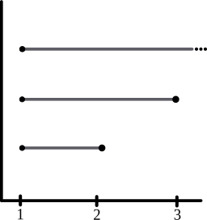 
     
    
  

---

<!-- .slide: data-auto-animate -->

**Example:** $lcq_n$ barcodes of links. **($lcq_2^{\mathbb K}$)**

  

    

      $\mathcal U$:
      
      $\rightarrow$
      
      $\rightarrow$
      
    

    

      $$
      \begin{array}{ccccc}
      \mathbb R^3 \setminus U_1 & \xrightarrow{} & \mathbb R^3 \setminus U_2 & \xrightarrow{} & \mathbb R^3 \setminus U_3\\
      \downarrow\scriptstyle{lcq_2^{\mathbb K}} & & \downarrow\scriptstyle{lcq_2^{\mathbb K}} &  & \downarrow\scriptstyle{lcq_2^{\mathbb K}} \\
      \mathbb K^3 & \xrightarrow{} & \mathbb K & \xrightarrow{} & 0\\
      \end{array}
      $$
    

    

    

    

      $\mathcal L$:
      
      $\rightarrow$
      
      $\rightarrow$
      
    

    

    $$
    \begin{array}{ccccc}
    \mathbb R^3 \setminus L_1 & \xrightarrow{} & \mathbb R^3 \setminus L_2 & \xrightarrow{} & \mathbb R^3 \setminus L_3\\
    \downarrow\scriptstyle{lcq_2^{\mathbb K}} & & \downarrow\scriptstyle{lcq_2^{\mathbb K}} &  & \downarrow\scriptstyle{lcq_2^{\mathbb K}} \\
    \mathbb K & \xrightarrow{} & 0 & \xrightarrow{} & 0\\
    \end{array}
    $$
    

    

  

  $\mathcal R$:
  
  $\rightarrow$
  
  $\rightarrow$
  

  

    $$
    \begin{array}{ccccc}
    \mathbb R^3 \setminus R_1 & \xrightarrow{} & \mathbb R^3 \setminus R_2 & \xrightarrow{} & \mathbb R^3 \setminus R_3\\
    \downarrow\scriptstyle{lcq_2^{\mathbb K}} & & \downarrow\scriptstyle{lcq_2^{\mathbb K}} &  & \downarrow\scriptstyle{lcq_2^{\mathbb K}} \\
    \mathbb K^3 & \xrightarrow{} & \mathbb K & \xrightarrow{} & 0\\
    \end{array}
    $$
  

---

<!-- .slide: data-auto-animate -->
**Example:** $lcq_n$ barcodes of links. **($lcq_2^{\mathbb K}$)**

  

    

      $\mathcal U$:
      
      $\rightarrow$
      
      $\rightarrow$
      
    

     
    

      $\mathcal L$:
      
      $\rightarrow$
      
      $\rightarrow$
      
    

     
    

      $\mathcal R$:
      
      $\rightarrow$
      
      $\rightarrow$
      
    

  

  

    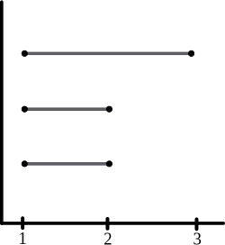 
    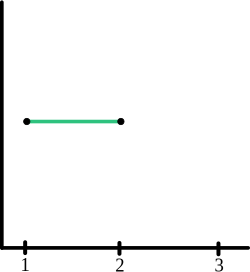 
    
  

---

<!-- .slide: data-auto-animate -->
**Example:** $lcq_n$ barcodes of links. **($lcq_3^{\mathbb K}$)**

  

    

      $\mathcal U$:
      
      $\rightarrow$
      
      $\rightarrow$
      
    

    

      $$
      \begin{array}{ccccc}
      \mathbb R^3 \setminus U_1 & \xrightarrow{} & \mathbb R^3 \setminus U_2 & \xrightarrow{} & \mathbb R^3 \setminus U_3\\
      \downarrow\scriptstyle{lcq_3^{\mathbb K}} & & \downarrow\scriptstyle{lcq_3^{\mathbb K}} &  & \downarrow\scriptstyle{lcq_3^{\mathbb K}} \\
      \mathbb K^8 & \xrightarrow{} & \mathbb K^2 & \xrightarrow{} & 0\\
      \end{array}
      $$
    

    

    

    

      $\mathcal L$:
      
      $\rightarrow$
      
      $\rightarrow$
      
    

    

      $$
      \begin{array}{ccccc}
      \mathbb R^3 \setminus L_1 & \xrightarrow{} & \mathbb R^3 \setminus L_2 & \xrightarrow{} & \mathbb R^3 \setminus L_3\\
      \downarrow\scriptstyle{lcq_3^{\mathbb K}} & & \downarrow\scriptstyle{lcq_3^{\mathbb K}} &  & \downarrow\scriptstyle{lcq_3^{\mathbb K}} \\
      \mathbb K^2 & \xrightarrow{} & 0 & \xrightarrow{} & 0\\
      \end{array}
      $$
    

  

  $\mathcal R$:
  
  $\rightarrow$
  
  $\rightarrow$
  

  

    $$
    \begin{array}{ccccc}
    \mathbb R^3 \setminus R_1 & \xrightarrow{} & \mathbb R^3 \setminus R_2 & \xrightarrow{} & \mathbb R^3 \setminus R_3\\
    \downarrow\scriptstyle{lcq_3^{\mathbb K}} & & \downarrow\scriptstyle{lcq_3^{\mathbb K}} &  & \downarrow\scriptstyle{lcq_3^{\mathbb K}} \\
    \mathbb K^6 & \xrightarrow{} & \mathbb K^2 & \xrightarrow{} & 0\\
    \end{array}
    $$
  

---

<!-- .slide: data-auto-animate -->
**Example:** $lcq_n$ barcodes of links. **($lcq_3^{\mathbb K}$)**

  

    

      $\mathcal U$:
      
      $\rightarrow$
      
      $\rightarrow$
      
    

     
    

      $\mathcal L$:
      
      $\rightarrow$
      
      $\rightarrow$
      
    

     
    

      $\mathcal R$:
      
      $\rightarrow$
      
      $\rightarrow$
      
    

  

  

    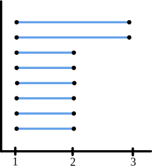 
    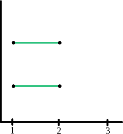 
    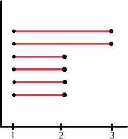
  

---
### GAP Code

<pre><code data-line-numbers="1, 5, 6, 8">LoadPackage("nq");

LcsQuotient := function(group, i)
    local nq, lcs;
    nq := NilpotentQuotient(group, i+1);
    lcs := LowerCentralSeries(nq);
    if i < Length(lcs) then
        return AbelianInvariants(lcs[i] / lcs[i+1]);
    fi;
    return TrivialGroup();
end;
</code></pre>

Using GAP 4 NQ Package **(Nickel, 2007)**.

---

<!-- .slide: data-auto-animate -->
### Summary
- <b>$ PH_* $ has limitations</b> to distinguish certain kinds of filtrations.

---

<!-- .slide: data-auto-animate -->
### Summary
- <b>$ PH_* $ has limitations</b> to distinguish certain kinds of filtrations.
  
- We have design an <b> eficient algorithm to compute $P\pi_1$</b> presentations.

---

<!-- .slide: data-auto-animate -->
### Summary
- <b>$ PH_* $ has limitations</b> to distinguish certain kinds of filtrations.
  
- We have design an <b> eficient algorithm to compute $P\pi_1$</b> presentations.
  
- We found a way of <b>computing $P\pi_1$ barcodes</b> using $ lcq_n $.

---

<!-- .slide: data-auto-animate -->
### Ongoing and future work

- Look for a computationally <b>efficient algorithm to compute $ lcq_n(G) $</b>.

---

<!-- .slide: data-auto-animate -->
### Ongoing and future work

- Look for a computationally <b>efficient algorithm to compute $ lcq_n(G) $</b>.

- Apply the methods to <b>metric spaces</b> and <b>real data</b>.

---

<!-- .slide: data-auto-animate -->
### Ongoing and future work

- Look for a computationally <b>efficient algorithm to compute $ lcq_n(G) $</b>.

- Apply the methods to <b>metric spaces</b> and <b>real data</b>.

- Explore for <b>abelian invariants</b> beyond $ lcq_n $.

---

### References

- <b>Robin Forman</b>. Morse theory for cell complexes. *Advances in Mathathematics*, 1998.

- <b>Ximena Fernández</b>. Morse theory for group presentations. *Transactions of the American Mathematical Society*, 2024.

- <b>Charles C. Sims</b>. Computation with finitely presented groups. *Cambridge University Press*, 1994.

- <b>Primoz Skraba</b> and <b>Mikael Vejdemo-Johansson</b>. Persistence modules: Algebra and algorithms.
  *Mathematics of Computation*, 2013.

- <b>Werner Nickel</b>. A gap 4 package computing nilpotent factor groups of finitely presented groups. *GAP 4 Package*, 2007.
